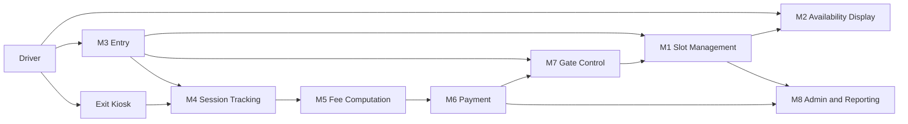
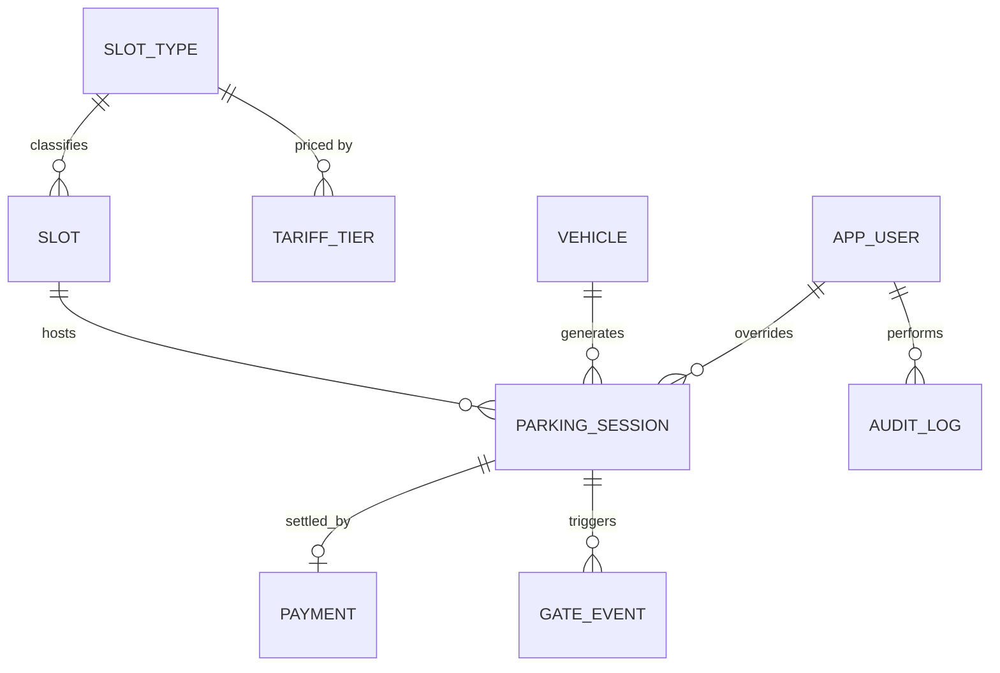

# SmartPark KE — Design Document (Task One)

**Course:** Data Structures and Algorithms
**Institution:** Multimedia University of Kenya
**Deliverable:** Task One — analysis, modules, algorithms, data structures, database design
**Proposed system name:** **SmartPark KE**

---

## 1. Critical Analysis of the Client's Terms of Reference

### 1.1 What the client explicitly asked for

| # | Stated requirement | Implication for design |
|---|---|---|
| R1 | Drivers must **see available slots before entry** (visual display) | Needs a real-time, publicly visible availability view and an O(1) count of free slots |
| R2 | System **records vehicles on arrival** | Needs identity capture (number plate), timestamp, and slot assignment |
| R3 | On exit, system **automatically computes time spent and amount due** | Needs an exact entry timestamp per vehicle and a fast lookup by plate |
| R4 | **Barrier opens on payment** of the parking fee | Gate control must be driven by payment state, not by exit request |
| R5 | Tiered fees: ≤30 min free; ≤2 h Kshs 50; ≤4 h Kshs 100; ≤6 h Kshs 300; >6 h Kshs 500 | Pricing must be table-driven, not hard-coded |
| R6 | Automating operations **in Kenya** | Local context: KRA-format plates, EAT timezone, M-Pesa as the dominant payment rail |

### 1.2 Gaps, ambiguities and risks in the terms of reference

A brief this short leaves several decisions to the developer. Each gap below is listed with the assumption this design adopts, so the assumption can be confirmed or corrected by the client.

1. **Charges beyond six hours are undefined.** "Over six hours is Kshs 500" would let a car park for a week for Kshs 500. *Assumption:* Kshs 500 applies per 24-hour period (or part thereof) beyond the 6-hour tier. Flagged for client confirmation — it is the single most expensive ambiguity in the brief.
2. **Payment method is unspecified.** *Assumption:* M-Pesa STK push is the primary rail, with a cash/attendant override. The payment module is written against an abstract `PaymentProvider` interface so the rail can be swapped.
3. **Vehicle classes are not differentiated.** Motorcycles, saloon cars and buses consume different amounts of space. *Assumption:* slots carry a type (`MOTORCYCLE`, `STANDARD`, `LARGE`, `ACCESSIBLE`) and the fee table is keyed by vehicle class, defaulting all classes to the stated tariff until the client says otherwise.
4. **Lost or damaged ticket** handling is not covered. *Assumption:* the plate, not the ticket, is the primary key of a session, so a lost ticket is recoverable by plate lookup; an attendant override is logged in the audit trail.
5. **Full-capacity behaviour** is not stated. *Assumption:* the entry barrier refuses admission and the display shows FULL when the free-slot structure is empty.
6. **Concurrency at the entry lane.** Two vehicles admitted within the same instant must never receive the same slot. This is a correctness requirement, handled by an atomic allocate operation (Section 4.1).
7. **Duplicate/ghost sessions.** A plate already recorded as inside must not be admitted again. Handled by an O(1) membership check on the active-session index.
8. **Clock authority.** Billing depends on time. *Assumption:* all timestamps are taken from the server in UTC and displayed in EAT (UTC+3); client devices are never trusted for billing time.
9. **Data protection.** Number plates are personal data under the Kenya Data Protection Act, 2019. *Assumption:* plates are stored for a defined retention period, access is role-restricted, and the audit log records who viewed or overrode what.
10. **Failure and power loss.** If the server is unreachable, the barrier must fail to a safe state. *Assumption:* fail-closed on entry, fail-open on exit for vehicles with a settled payment, with events queued for later reconciliation.
11. **Reservations / season tickets** are not mentioned but are the most likely next request. The slot model reserves a `status = RESERVED` state so this is an extension, not a rewrite.

### 1.3 Non-functional requirements derived from the brief

- **Latency:** entry and exit decisions must complete in well under a second at the barrier — this is what drives the choice of O(1) and O(log n) structures rather than linear scans.
- **Availability:** the display is public-facing and must survive a backend hiccup gracefully (last-known state with a staleness indicator).
- **Auditability:** every money-affecting event (fee computed, payment received, override applied, barrier opened) is written to an append-only log.
- **Configurability:** tariffs, slot counts and grace periods change without redeploying code.

---

## 2. Proposed Modules

The terms of reference decompose naturally into eight modules.

| Module | Responsibility | Maps to |
|---|---|---|
| **M1 — Slot Management** | Maintains the state of every slot; allocates and releases slots | R1, R2 |
| **M2 — Availability Display** | Public real-time view: free/occupied per slot, counts per zone | R1 |
| **M3 — Vehicle Entry (Check-In)** | Validates plate, allocates a slot, opens entry barrier, issues ticket | R2 |
| **M4 — Session Tracking** | Holds all currently-parked vehicles and their entry timestamps | R2, R3 |
| **M5 — Fee Computation** | Converts a duration into an amount using the tariff table | R3, R5 |
| **M6 — Payment Processing** | Initiates, confirms and records payment; produces a receipt | R4 |
| **M7 — Gate/Barrier Control** | Opens entry and exit barriers only on an authorised trigger | R4 |
| **M8 — Administration & Reporting** | Tariff configuration, occupancy and revenue reports, audit log, user roles | Non-functional |

### 2.1 Module interaction



---

## 3. Algorithms per Module

Pseudocode is given in a language-neutral form. Complexities assume `n` slots and `k` active sessions (`k ≤ n`).

### M1 — Slot Management

```
ALGORITHM AllocateSlot(vehicleClass)
INPUT : vehicleClass
OUTPUT: slotId, or NULL if no suitable slot exists

1.  heap <- freeSlotHeap[vehicleClass]        // min-heap keyed by walking distance
2.  ACQUIRE lock on heap                      // guarantees no two vehicles get one slot
3.  IF heap is empty THEN
4.        RELEASE lock ; RETURN NULL          // lot is full for this class
5.  slot <- heap.extractMin()                 // nearest free slot
6.  slotTable[slot.id].status <- OCCUPIED
7.  freeCount[vehicleClass] <- freeCount[vehicleClass] - 1
8.  RELEASE lock
9.  PUBLISH slotChanged(slot.id, OCCUPIED)    // pushes M2 display update
10. RETURN slot.id
```
*Complexity:* O(log n) time, O(n) space.

```
ALGORITHM ReleaseSlot(slotId)
1.  ACQUIRE lock
2.  IF slotTable[slotId].status <> OCCUPIED THEN RELEASE lock ; RETURN ERROR
3.  slotTable[slotId].status <- FREE
4.  freeSlotHeap[slotTable[slotId].class].insert(slotId, distance(slotId))
5.  freeCount[class] <- freeCount[class] + 1
6.  RELEASE lock
7.  PUBLISH slotChanged(slotId, FREE)
```
*Complexity:* O(log n).

### M2 — Availability Display

```
ALGORITHM GetAvailability()
1.  FOR EACH class IN vehicleClasses
2.        summary[class] <- freeCount[class]          // O(1), counter kept incrementally
3.  RETURN { summary, slotTable.snapshot(), generatedAt = now() }
```
*Complexity:* O(1) for the headline counts, O(n) only when rendering the full slot map. The counters are maintained on every allocate/release so the display never scans the lot.

### M3 — Vehicle Entry (Check-In)

```
ALGORITHM CheckIn(plateRaw, vehicleClass)
1.  plate <- Normalise(plateRaw)                  // upper-case, strip spaces/hyphens
2.  IF NOT MatchesPlateFormat(plate) THEN RETURN REJECT("invalid plate")
3.  IF plate IN activeSessions THEN               // O(1) hash lookup
4.        RETURN REJECT("vehicle already inside")  // prevents ghost/duplicate sessions
5.  IF plate IN blacklist THEN RETURN REJECT("barred vehicle")   // O(1) set lookup
6.  slotId <- AllocateSlot(vehicleClass)          // M1, O(log n)
7.  IF slotId = NULL THEN
8.        entryQueue.enqueue(plate)               // FIFO waiting lane
9.        RETURN REJECT("parking full")
10. session <- NewSession(id, plate, slotId, entryTime = serverNow())
11. activeSessions[plate] <- session              // O(1) insert
12. entryOrder.append(session)                    // doubly-linked list, chronological
13. PERSIST session TO parking_sessions           // durable record
14. OpenBarrier(ENTRY)                            // M7
15. RETURN Ticket(session.id, slotId, entryTime)
```
*Complexity:* O(log n) dominated by slot allocation.

### M4 — Session Tracking

```
ALGORITHM FindSession(plateRaw)
1.  plate <- Normalise(plateRaw)
2.  IF plate NOT IN activeSessions THEN RETURN NULL
3.  RETURN activeSessions[plate]                  // O(1)
```

```
ALGORITHM ListOverstays(thresholdHours)
1.  result <- empty list
2.  FOR EACH session IN entryOrder                // oldest first
3.        IF serverNow() - session.entryTime < thresholdHours THEN BREAK   // early exit
4.        result.append(session)
5.  RETURN result
```
*Complexity:* O(m) where m is the number of overstaying vehicles, because the list is kept in entry order — no full scan of k sessions is needed.

### M5 — Fee Computation

```
ALGORITHM ComputeFee(entryTime, exitTime, vehicleClass)
INPUT : two timestamps, vehicle class
OUTPUT: minutes parked, amount in Kshs

1.  minutes <- CEIL((exitTime - entryTime) / 60)      // round up to the minute
2.  IF minutes <= 0 THEN RETURN (0, 0)                // clock skew guard
3.  tiers <- tariffTable[vehicleClass]                // sorted ascending by upperBoundMinutes
4.  // tiers = [(30, 0), (120, 50), (240, 100), (360, 300)]  with overflow rule (500 per 24h)
5.  lo <- 0 ; hi <- tiers.length - 1 ; chosen <- NULL
6.  WHILE lo <= hi DO                                  // binary search for the first tier
7.        mid <- (lo + hi) / 2                         // whose bound >= minutes
8.        IF tiers[mid].upperBoundMinutes >= minutes THEN
9.              chosen <- tiers[mid] ; hi <- mid - 1
10.       ELSE lo <- mid + 1
11. IF chosen <> NULL THEN RETURN (minutes, chosen.amount)
12. // beyond the last tier: overflow rule
13. days <- CEIL(minutes / 1440)
14. RETURN (minutes, days * overflowRate)              // overflowRate = 500
```
*Complexity:* O(log t) for t tiers — effectively O(1) since t is tiny, but written as a binary search so the tariff can grow to any size without a code change.

**Worked checks against the brief:** 25 min → Kshs 0; 30 min → Kshs 0; 31 min → Kshs 50; 2 h 00 → Kshs 50; 2 h 01 → Kshs 100; 4 h → Kshs 100; 5 h 30 → Kshs 300; 6 h → Kshs 300; 7 h → Kshs 500; 30 h → Kshs 1000 under the assumed overflow rule.

### M6 — Payment Processing

```
ALGORITHM SettleAndExit(plateRaw, method)
1.  session <- FindSession(plateRaw)                   // O(1)
2.  IF session = NULL THEN RETURN ERROR("no active session")
3.  exitTime <- serverNow()
4.  (minutes, amount) <- ComputeFee(session.entryTime, exitTime, session.class)   // M5
5.  session.exitTime <- exitTime ; session.minutes <- minutes ; session.amount <- amount
6.  IF amount = 0 THEN
7.        session.status <- PAID                       // free grace period
8.  ELSE
9.        ref <- PaymentProvider.charge(amount, session.id, method)   // e.g. M-Pesa STK
10.       IF ref.status <> SUCCESS THEN
11.             session.status <- AWAITING_PAYMENT
12.             RETURN DENY(amount, ref.failureReason)  // barrier stays shut (R4)
13.       PERSIST Payment(ref, session.id, amount, method)
14.       session.status <- PAID
15. ReleaseSlot(session.slotId)                        // M1, O(log n)
16. REMOVE plate FROM activeSessions                   // O(1)
17. REMOVE session FROM entryOrder                     // O(1) via stored node pointer
18. PERSIST session AS CLOSED
19. OpenBarrier(EXIT)                                  // M7
20. WRITE auditLog("EXIT", session.id, amount)
21. RETURN Receipt(session.id, minutes, amount, ref)
```
*Complexity:* O(log n), excluding the external payment round-trip.

Steps 9–14 are the heart of R4: the barrier call at step 19 is unreachable unless the session reached `PAID`.

### M7 — Gate/Barrier Control

```
ALGORITHM OpenBarrier(gate)
1.  IF NOT AuthorisedTrigger(gate) THEN REJECT and log intrusion attempt
2.  gateCommandQueue.enqueue(OPEN, gate, now())        // FIFO, one physical arm
3.  WAIT for sensor confirmation OR timeout T
4.  IF timeout THEN RAISE alert to attendant console
5.  ON vehicle-cleared sensor: gateCommandQueue.enqueue(CLOSE, gate, now())
6.  WRITE gateEvent TO gate_events
```
*Complexity:* O(1) per command. The queue serialises commands so overlapping requests cannot interleave on one physical barrier.

### M8 — Administration & Reporting

```
ALGORITHM DailyRevenueReport(date)
1.  rows <- SELECT amount, minutes FROM parking_sessions
              WHERE exit_time BETWEEN startOfDay(date) AND endOfDay(date)
              AND status = 'CLOSED'                    // uses index on exit_time
2.  total <- SUM(rows.amount) ; count <- COUNT(rows)
3.  avgStay <- MEAN(rows.minutes)
4.  peak <- HistogramByHour(rows)
5.  RETURN report
```
*Complexity:* O(r log r) at worst on the database side with the index on `exit_time`; kept out of the hot path entirely.

---

## 4. Data Structures and Justification

| # | Structure | Where used | Why this one | Operations & cost |
|---|---|---|---|---|
| 1 | **Hash map** (plate → session) | M4 `activeSessions` | The exit flow's very first act is "find this car by plate". A list or database scan would be O(k) at the barrier with a driver waiting; hashing makes it constant. Also gives the O(1) duplicate-entry check at M3 step 3. | lookup/insert/delete O(1) avg |
| 2 | **Array / direct-index table** (slotId → slot record) | M1 `slotTable` | Slot IDs are dense integers 0…n-1, so the array index *is* the key. Random access to any slot's state in O(1) with no hashing overhead, and it is the natural backing store for the display grid. | access/update O(1) |
| 3 | **Min-heap (priority queue)** of free slots | M1 `freeSlotHeap` | The client wants *good* allocation, not just any free slot. Keying the heap by walking distance from the entrance means the nearest free bay is always at the root. A plain list of free slots would need an O(n) scan to find the nearest. | extractMin/insert O(log n), peek O(1) |
| 4 | **Integer counters** per class | M1/M2 `freeCount` | The public display refreshes constantly. Recomputing "how many free?" by scanning n slots every refresh is wasteful; maintaining the count incrementally on allocate/release makes the headline number O(1). | O(1) |
| 5 | **Queue (FIFO)** | M3 `entryQueue`, M7 `gateCommandQueue` | Both model genuine first-come-first-served physical realities: cars queue at a full lot in arrival order, and one barrier arm can only execute one command at a time. FIFO is the fairness guarantee the hardware needs. | enqueue/dequeue O(1) |
| 6 | **Doubly-linked list** of sessions in entry order | M4 `entryOrder` | Overstay checks want the oldest vehicles first, and closing a session must remove it in O(1). Storing the node pointer inside the session record makes deletion O(1) without searching — an array would be O(k) to delete from the middle. | append/delete O(1), traverse O(k) |
| 7 | **Hash set** | M3 `blacklist`, reserved plates | Pure membership questions with no associated value; a set gives the answer in O(1) with minimal space. | contains O(1) avg |
| 8 | **Sorted array + binary search** (tariff tiers) | M5 `tariffTable` | Fee bands are an ordered, range-based lookup. Keeping them sorted and searching by bisection keeps the rule *data* rather than a chain of `if` statements, so the client can re-price without touching code — directly answering the "dynamic" requirement. | search O(log t) |
| 9 | **Append-only log (stack-like/ledger)** | M8 `auditLog` | Money events must never be edited in place. An append-only structure gives natural chronological replay and makes the most recent action available for attendant "undo last override" semantics. | append O(1) |
| 10 | **Graph (adjacency list)** — optional extension | Multi-level lot navigation | If the lot spans floors, "nearest slot" becomes a shortest-path problem from the gate node; Dijkstra over the aisle graph replaces the static distance key in the heap. | Dijkstra O(E log V) |
| 11 | **B-tree indexes** | Database layer | Provided by the DBMS on `plate`, `entry_time`, `exit_time`; keeps reporting queries logarithmic instead of full table scans. | search O(log N) |

### 4.1 Why this combination is correct, not just fast

The in-memory structures (1–9) are a **cache of hot state**; the database (Section 5) is the durable record. Every mutation writes to both, database first for money-affecting events. The slot heap and the slot table are guarded by a single lock per class so that `AllocateSlot` is atomic — this is what prevents two drivers admitted in the same second from being sent to bay A-07 together. On restart, the in-memory structures are rebuilt in O(k log n) by replaying open sessions from `parking_sessions`.

---

## 5. Dynamic Database Design

"Dynamic" is taken to mean three things: the schema grows with the business (slots, tariffs and classes are rows, not constants); the data changes continuously in real time; and no operational rule is hard-coded.

### 5.1 Entity-Relationship model



### 5.2 Schema

```sql
CREATE TABLE slot_type (
    id            SERIAL PRIMARY KEY,
    code          VARCHAR(20) UNIQUE NOT NULL,   -- MOTORCYCLE, STANDARD, LARGE, ACCESSIBLE
    description   VARCHAR(100)
);

CREATE TABLE slot (
    id            SERIAL PRIMARY KEY,
    label         VARCHAR(10) UNIQUE NOT NULL,   -- 'A-07'
    zone          VARCHAR(20)  NOT NULL,
    floor         SMALLINT     NOT NULL DEFAULT 0,
    slot_type_id  INT REFERENCES slot_type(id),
    walk_distance INT NOT NULL,                  -- heap key, metres from gate
    status        VARCHAR(12) NOT NULL DEFAULT 'FREE'
                  CHECK (status IN ('FREE','OCCUPIED','RESERVED','OUT_OF_SERVICE')),
    updated_at    TIMESTAMPTZ NOT NULL DEFAULT now()
);
CREATE INDEX idx_slot_status ON slot(status, slot_type_id);

CREATE TABLE vehicle (
    id            SERIAL PRIMARY KEY,
    plate         VARCHAR(15) UNIQUE NOT NULL,   -- normalised, e.g. KDA123A
    slot_type_id  INT REFERENCES slot_type(id),
    is_blacklisted BOOLEAN NOT NULL DEFAULT FALSE,
    first_seen    TIMESTAMPTZ NOT NULL DEFAULT now()
);
CREATE INDEX idx_vehicle_plate ON vehicle(plate);

CREATE TABLE tariff_tier (                       -- pricing is DATA, not code
    id                   SERIAL PRIMARY KEY,
    slot_type_id         INT REFERENCES slot_type(id),
    upper_bound_minutes  INT,                    -- NULL = overflow tier
    amount_kes           NUMERIC(10,2) NOT NULL,
    per_period_minutes   INT,                    -- 1440 for the >6h daily rule
    effective_from       TIMESTAMPTZ NOT NULL DEFAULT now(),
    effective_to         TIMESTAMPTZ            -- NULL = currently active
);
-- Seeded from the client brief (STANDARD):
-- (30, 0.00), (120, 50.00), (240, 100.00), (360, 300.00), (NULL, 500.00 per 1440 min)

CREATE TABLE parking_session (
    id            BIGSERIAL PRIMARY KEY,
    vehicle_id    INT  NOT NULL REFERENCES vehicle(id),
    slot_id       INT  NOT NULL REFERENCES slot(id),
    entry_time    TIMESTAMPTZ NOT NULL DEFAULT now(),
    exit_time     TIMESTAMPTZ,
    minutes_parked INT,
    amount_due    NUMERIC(10,2),
    status        VARCHAR(20) NOT NULL DEFAULT 'ACTIVE'
                  CHECK (status IN ('ACTIVE','AWAITING_PAYMENT','PAID','CLOSED','VOIDED')),
    ticket_code   VARCHAR(20) UNIQUE,
    closed_by     INT REFERENCES app_user(id)
);
CREATE INDEX idx_session_active ON parking_session(status)
       WHERE status IN ('ACTIVE','AWAITING_PAYMENT');
CREATE INDEX idx_session_exit   ON parking_session(exit_time);
-- Integrity rule: at most one ACTIVE session per vehicle
CREATE UNIQUE INDEX uq_active_vehicle ON parking_session(vehicle_id)
       WHERE status IN ('ACTIVE','AWAITING_PAYMENT');

CREATE TABLE payment (
    id            BIGSERIAL PRIMARY KEY,
    session_id    BIGINT NOT NULL REFERENCES parking_session(id),
    amount_kes    NUMERIC(10,2) NOT NULL,
    method        VARCHAR(20) NOT NULL,          -- MPESA, CARD, CASH
    provider_ref  VARCHAR(60),                   -- M-Pesa receipt number
    status        VARCHAR(20) NOT NULL,          -- PENDING, SUCCESS, FAILED, REVERSED
    paid_at       TIMESTAMPTZ NOT NULL DEFAULT now()
);
CREATE UNIQUE INDEX uq_provider_ref ON payment(provider_ref) WHERE provider_ref IS NOT NULL;

CREATE TABLE gate_event (
    id            BIGSERIAL PRIMARY KEY,
    session_id    BIGINT REFERENCES parking_session(id),
    gate          VARCHAR(10) NOT NULL,          -- ENTRY, EXIT
    action        VARCHAR(10) NOT NULL,          -- OPEN, CLOSE, DENY
    reason        VARCHAR(60),
    occurred_at   TIMESTAMPTZ NOT NULL DEFAULT now()
);

CREATE TABLE app_user (
    id            SERIAL PRIMARY KEY,
    username      VARCHAR(40) UNIQUE NOT NULL,
    password_hash VARCHAR(255) NOT NULL,
    role          VARCHAR(20) NOT NULL           -- ADMIN, ATTENDANT, VIEWER
);

CREATE TABLE audit_log (                          -- append-only
    id            BIGSERIAL PRIMARY KEY,
    user_id       INT REFERENCES app_user(id),
    action        VARCHAR(40) NOT NULL,
    entity        VARCHAR(40),
    entity_id     BIGINT,
    detail        JSONB,
    occurred_at   TIMESTAMPTZ NOT NULL DEFAULT now()
);
```

### 5.3 Normalisation and design notes

- The schema is in **3NF**: plates live once in `vehicle`, prices once in `tariff_tier`, and no session row stores a derived value that cannot be recomputed from its timestamps. `minutes_parked` and `amount_due` are stored deliberately as a *historical snapshot* — if the tariff changes tomorrow, yesterday's receipt must not change with it.
- `tariff_tier.effective_from/effective_to` make pricing **temporal**: a new tariff is inserted rather than an old one edited, so historical billing remains explainable and auditable.
- The partial unique index `uq_active_vehicle` enforces "one car, one open session" at the database level, so the rule holds even if application code is bypassed.
- Indexes are placed exactly where the hot paths read: plate lookup on exit, status filter for the live display, `exit_time` for revenue reporting.
- `slot.status` is denormalised state duplicated from the active session on purpose — it is what the public display reads, and reading one indexed column beats joining sessions on every refresh.

### 5.4 Mapping between structures and storage

| In-memory structure | Rebuilt on startup from |
|---|---|
| `activeSessions` hash map | `SELECT … FROM parking_session WHERE status IN ('ACTIVE','AWAITING_PAYMENT')` |
| `slotTable` array | `SELECT … FROM slot ORDER BY id` |
| `freeSlotHeap` | the same query, filtered to `status = 'FREE'`, heapified by `walk_distance` |
| `blacklist` set | `SELECT plate FROM vehicle WHERE is_blacklisted` |
| `tariffTable` sorted array | `SELECT … FROM tariff_tier WHERE effective_to IS NULL ORDER BY upper_bound_minutes` |

---

## 6. Complexity Summary

| Operation | Time | Structure responsible |
|---|---|---|
| Show free-slot counts | O(1) | incremental counters |
| Render full slot map | O(n) | slot array |
| Check-in a vehicle | O(log n) | hash map + min-heap |
| Reject duplicate entry | O(1) | hash map |
| Find vehicle at exit | O(1) | hash map |
| Compute fee | O(log t) ≈ O(1) | sorted tariff array + binary search |
| Release slot on exit | O(log n) | min-heap |
| List overstays | O(m) | entry-ordered linked list |
| Daily revenue report | O(r log r) | B-tree index on `exit_time` |
| Restart recovery | O(k log n) | replay of open sessions |

---

## 7. Assumptions Register (for client sign-off)

1. Kshs 500 applies per 24-hour period beyond six hours.
2. Billing time is server time in EAT; durations round **up** to the nearest minute.
3. The plate is the primary identity of a session; the ticket is a convenience.
4. M-Pesa is the default payment rail, with an attendant cash override that is audited.
5. All classes share the stated tariff until class-specific pricing is supplied.
6. The lot is single-level; multi-level navigation is an identified extension.
7. Plates are retained for 12 months and then anonymised, per the Data Protection Act, 2019.

---

## 8. Next Step (Task Two)

These modules map one-to-one onto the implementation: `slots.py` (M1, M2), `entry.py` (M3), `sessions.py` (M4), `billing.py` (M5), `payments.py` (M6), `gates.py` (M7), `admin.py` (M8), over the schema in Section 5, exposed as a Flask web application with a live availability board.
